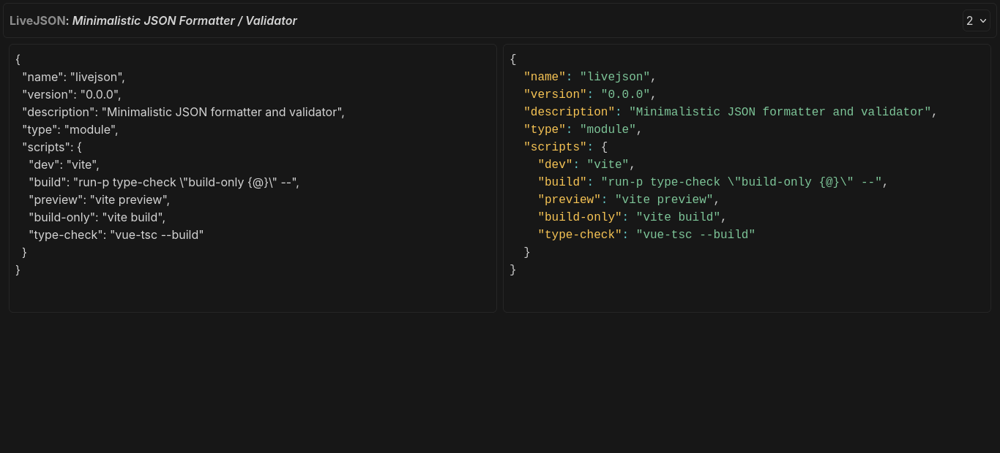

# LiveJSON

A  minimalistic JSON **formatter and validator**



## Features

- **Live validation**, as you type
- **Syntax Highlighting** with Prism.js
- **Persistence**, automatically saves to localStorage
- Written in **TypeScript and Vue**

## Demo

Try it live on [livejson.juanvel400.xyz](https://livejson.juanvel400.xyz)

## Quickstart

```sh
  # clone the repository
  git clone https://github.com/juanvel4000/livejson.git
  cd livejson
  
  # install dependencies
  npm install

  # start development server
  npm run dev

  # it should now be accessible from http://localhost:5173
```

### For Production

```sh
  npm run build
```

The build files will be available in the `dist/` directory

## Keyboard Shortcuts

| Shortcut          | Action                         |
|----------------|----------------------|
| `Ctrl+S`           |  Save as a `.json` file   |

## Stack

- Vue 3 + TypeScript
- TailwindCSS
- [Prism.js](https://prismjs.com) for syntax highlighting


## License

[BSD 3-Clause](https://spdx.org/licenses/BSD-3-Clause.html)
